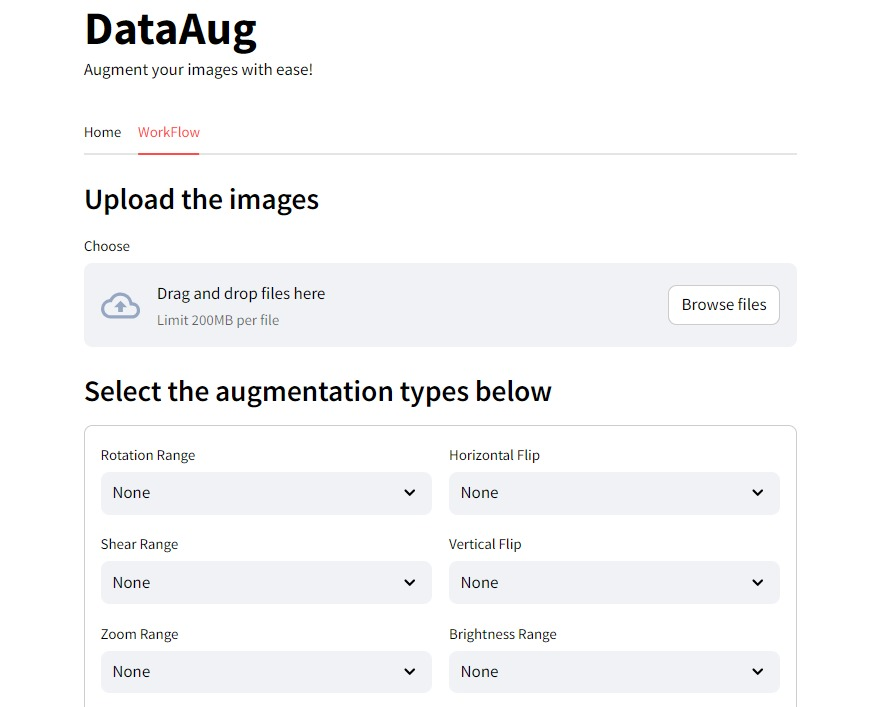

# DataAug


## Welcome to the Data Augmentation Application
This application is made to perform data augmentation with an easy to use interface. You are provided with various traditional data augmentation techniques like rotation, crop, zooming, etc,. with a friendly user interface.

## Abstract
The Simplified Image Data Augmentation Application **DataAug** is a user-friendly tool designed to simplify the process of augmenting image datasets for machine learning and computer vision tasks. Users can easily input their image datasets and specify augmentation techniques such as rotation, scaling, flipping, cropping, and adjusting brightness etc., This application aims to streamline the data augmentation process, enabling researchers, practitioners, and enthusiasts to enhance their datasets effortlessly and efficiently.

## Requirements
- Python 3.x
- TensorFlow
- Streamlit
- Streamlit Authenticator
- Firebase (for database storage)

## Implementation
- The project is implemented in Python using the TensorFlow library for image data manipulation and augmentation. 
- The front end is developed using Streamlit, providing an intuitive web-based interface for users to interact with. 
- Streamlit Authenticator is used for user authentication and authorization. 
- Augmentation techniques such as rotation, scaling, flipping, cropping, and brightness  adjustment are implemented using TensorFlow's built-in functionalities. 
- Firebase is utilized for database storage.
- Finally the application is seamlessly deployed in streamlit cloud.

## Project Structure
```
DataAugmentationApp/
│
├── src/DataAugmentationApp
│   ├── ImageDataGeneration.py  # Augmentation process implementation
│   ├── logger.py               # logging
│   ├── utils.py                # utilities 
│   └── ...
│
├── streamlitApp.py             # main application
├── setup.py                    # setup for python package
├── requirements.txt            # requirements
├──  README.md                  # Project README file
└── ...
```

## Usage
1. Clone the repository to your local machine.
2. Install the required dependencies using `pip install -r requirements.txt`.
3. Set up Firebase for database storage and configure authentication using Streamlit Authenticator.
4. Run the Streamlit application using `streamlit run streamlitApp.py`.
5. Use the web-based interface to input your image datasets and specify augmentation techniques.
6. Specify the number of augmented images to be generated for each input image.
7. Click the "AUGMENTATE" button to start the augmentation process.
8. The augmented images will be saved to the specified output directory.

## Conclusion
The Simplified Image Data Augmentation Application provides a simple and efficient solution for enhancing image datasets through augmentation techniques. By leveraging Streamlit for the front end and Firebase for database storage, this application offers a seamless user experience and secure data management. With its intuitive interface and powerful augmentation capabilities, the application promises to be a valuable tool for researchers, practitioners, and enthusiasts in the machine learning and computer vision communities.


## DataAug Applicaion Usage.
*link : Please visit the application here **[DataAug](https://dataaug.streamlit.app/)*** 
 
Perform Data Augmentation for Your Images using the DataAug Application.


### Steps
- Go to the **WorkFlow** tab.
- Upload the images.
- Select the augmentation types below with appropriate parameters.
- Click on the **AUGMENTATE** button.
- Download the augmented images using the **Download Images** button.

---

### Hey feel free to reach out.